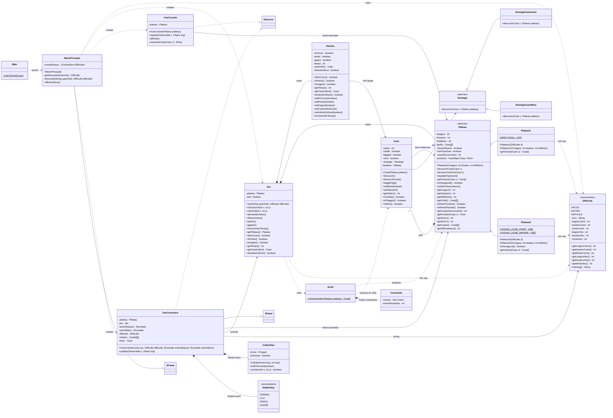

# UML Class Diagram (Demineur)

```mermaid
classDiagram
    direction LR

    class Main {
        +main(String[] args)$
    }

    class Difficulte {
        <<enumeration>>
        FACILE
        MOYEN
        DIFFICILE
        -nom : String
        -largeurCarre : int
        -hauteurCarre : int
        -minesCarre : int
        -largeurHex : int
        -hauteurHex : int
        -minesHex : int
        +getLargeurCarre() int
        +getHauteurCarre() int
        +getMinesCarre() int
        +getLargeurHex() int
        +getHauteurHex() int
        +getMinesHex() int
        +toString() String
    }

    class EtatJeu {
        -enCours : boolean
        -perdu : boolean
        -gagne : boolean
        -temps : int
        -caseIndice : Case
        -indiceEstSure : boolean
        +isEnCours() boolean
        +isPerdu() boolean
        +isGagne() boolean
        +getTemps() int
        +getCaseIndice() Case
        +isIndiceEstSure() boolean
        +setEnCours(boolean)
        +setPerdu(boolean)
        +setGagne(boolean)
        +setCaseIndice(Case)
        +setIndiceEstSure(boolean)
        +incrementerTemps()
    }

    class Jeu {
        -plateau : Plateau
        -etat : EtatJeu
        +Jeu(String typeGrille, Difficulte difficulte)
        +clicGauche(int x, int y)
        +clicDroit(int x, int y)
        +demanderIndice()
        +effacerIndice()
        +perdre()
        +gagner()
        +incrementerTemps()
        +getPlateau() Plateau
        +isEnCours() boolean
        +isPerdu() boolean
        +isGagne() boolean
        +getTemps() int
        +getCaseIndice() Case
        +isIndiceEstSure() boolean
    }

    class JeuIA {
        +chercherIndice(Plateau plateau) Case[]$
    }

    class Contrainte {
        -caches : Set~Case~
        -minesRestantes : int
    }

    class Case {
        -valeur : int
        -visible : boolean
        -flagged : boolean
        -mine : boolean
        -strategie : Strategie
        #plateau : Plateau
        +Case(Plateau plateau)
        +decouvrir()
        +decouvrirForce()
        +toggleFlag()
        +setMine(boolean)
        +setValeur(int)
        +getValeur() int
        +isVisible() boolean
        +isFlagged() boolean
        +isMine() boolean
    }

    class Plateau {
        <<abstract>>
        #largeur : int
        #hauteur : int
        #nbMines : int
        #grille : Case[][]
        -minesPlacees : boolean
        -mineTouchee : boolean
        -casesDecouvertes : int
        -positions : HashMap~Case, Point~
        +Plateau(int largeur, int hauteur, int nbMines)
        +decouvrirCase(Case c)
        +decouvrirVoisins(Case c)
        +signalerExplosion()
        +getVoisins(Case c) Case[]*
        +isHexagonal() boolean
        +notifierObservateurs()
        +getLargeur() int
        +getHauteur() int
        +getNbMines() int
        +getGrille() Case[][]
        +isMineTouchee() boolean
        +isMinesPlacees() boolean
        +getCasesDecouvertes() int
        +getPosition(Case c) Point
        +getSizeX() int
        +getSizeY() int
        +getCases() Case[][]
        +getNbDrapeaux() int
    }

    class PlateauC {
        -DIRECTIONS : int[][]$
        +PlateauC(Difficulte d)
        +PlateauC(int largeur, int hauteur, int nbMines)
        +getVoisins(Case c) Case[]
    }

    class PlateauH {
        -VOISINS_LIGNE_PAIRE : int[][]$
        -VOISINS_LIGNE_IMPAIRE : int[][]$
        +PlateauH(Difficulte d)
        +PlateauH(int largeur, int hauteur, int nbMines)
        +isHexagonal() boolean
        +getVoisins(Case c) Case[]
    }

    class Strategie {
        <<abstract>>
        +decouvrir(Case c, Plateau plateau)*
    }

    class StrategieCaseLibre {
        +decouvrir(Case c, Plateau plateau)
    }

    class StrategieCaseMine {
        +decouvrir(Case c, Plateau plateau)
    }

    class MenuPrincipal {
        -comboNiveau : JComboBox~Difficulte~
        +MenuPrincipal()
        -getNiveauSelectionne() Difficulte
        -lancerJeu(String typeGrille, Difficulte difficulte)
        +afficherMenu()
    }

    class VueConsole {
        -plateau : Plateau
        +VueConsole(Plateau plateau)
        +update(Observable o, Object arg)
        +afficher()
        -representCase(Case c) String
    }

    class VueControleur {
        -plateau : Plateau
        -jeu : Jeu
        -actionRejouer : Runnable
        -actionMenu : Runnable
        -difficulte : Difficulte
        -cellules : JLabel[][]
        -timer : Timer
        +VueControleur(Jeu jeu, Difficulte difficulte, Runnable actionRejouer, Runnable actionMenu)
        +update(Observable o, Object arg)
    }

    class CelluleHex {
        -forme : Polygon
        -enfoncee : boolean
        +CelluleHex(int larg, int haut)
        +setEnfoncee(boolean)
        +contains(int x, int y) boolean
    }

    class EtatSmiley {
        <<enumeration>>
        NORMAL
        CLIC
        PERDU
        GAGNE
    }

    Main ..> MenuPrincipal : launch

    MenuPrincipal ..> Difficulte : uses
    MenuPrincipal ..> Jeu : creates
    MenuPrincipal ..> VueConsole : creates
    MenuPrincipal ..> VueControleur : creates

    Jeu *-- EtatJeu : owns
    Jeu *-- Plateau : owns
    Jeu ..> Difficulte : ctor arg
    Jeu ..> JeuIA : calls

    EtatJeu --> Case : hint target

    JeuIA ..> Plateau : analyzes
    JeuIA ..> Case : reasons on cells
    JeuIA *-- Contrainte : builds constraints

    Plateau <|-- PlateauC
    Plateau <|-- PlateauH

    Plateau *-- "1..*" Case : grid
    Case --> Plateau : back reference
    Case --> Strategie : behavior

    Strategie <|-- StrategieCaseLibre
    Strategie <|-- StrategieCaseMine

    PlateauC ..> Difficulte : ctor arg
    PlateauH ..> Difficulte : ctor arg

    VueControleur ..|> Observer
    VueControleur --|> JPanel
    VueControleur --> Plateau : observes/reads
    VueControleur --> Jeu : controls
    VueControleur --> Difficulte : sizing
    VueControleur *-- CelluleHex : nested class
    VueControleur *-- EtatSmiley : nested enum

    VueConsole ..|> Observer
    VueConsole --> Plateau : observes/reads

    MenuPrincipal --|> JFrame
```
